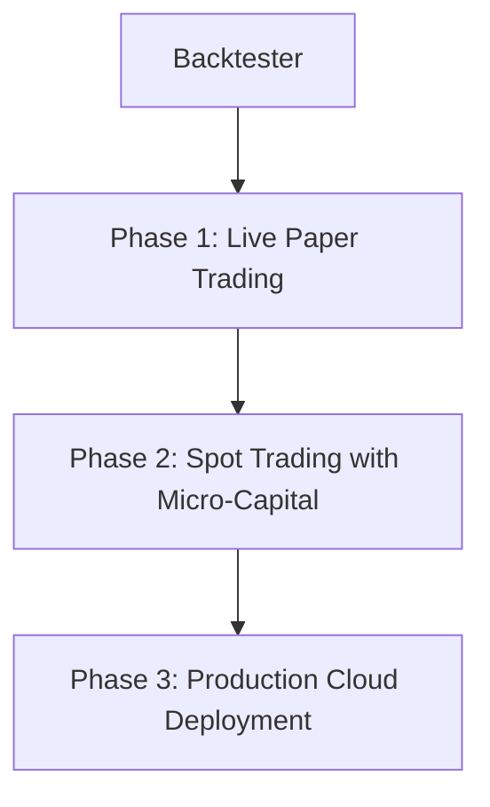

# Live Trading Blueprint: Moving from Simulation to Real Money

This document provides a technical roadmap and architectural layout for improving the `btc-algo-trader` system and safely deploying it to execute real-world trades using actual funds.

---

## ️ Step 1: Real-World Backtesting Improvements

Before exposing capital, you must eliminate standard backtesting biases:

### 1. Market Slippage & Latency
In simulation, orders fill instantly at the candle's close price. In the real world, it takes time (50ms–200ms) to route your order to the exchange, during which the price will fluctuate.
* **Solution:** Model a delay penalty. When executing a buy, adjust the purchase price up by a tiny percentage (e.g. 0.05% slippage). When executing a sell, adjust the price down.

### 2. Bid-Ask Spread
Crypto order books maintain a gap between the highest bid (sell price) and lowest ask (buy price).
* **Solution:** Instead of backtesting using standard `Close` prices, fetch order book spread averages or apply a fixed spread penalty to all transactions.

### 3. Stop-Loss (SL) & Take-Profit (TP)
Live trades need automated safety nets to exit positions without manual intervention.
* **Solution:** Add parameters to the strategy:
  - `stop_loss_pct` (e.g. 0.02 = exit trade if price drops 2% below entry).
  - `take_profit_pct` (e.g. 0.05 = exit trade if price rises 5% above entry).

---

##  Step 2: The Deployment Roadmap

Transitioning to live markets should be done incrementally using this three-stage framework:



### Phase 1: Live Paper Trading (WebSockets)
Run the bot on live market ticks using fake balances. This tests network stability, API rate limiting, and real-time execution speeds.

1. **Live Data Pipeline:** Replace CCXT's history loop with live polling (e.g. hourly cron/schedule) or WebSockets (`ccxt.pro`).
2. **Mock Wallet:** Initialize an SQLite database table tracking a mock cash/holdings balance.
3. **Trigger Signals:** Run calculations on each candle close. If a signal changes, log the simulated trade parameters.
4. **Notifications:** Integrate a Discord or Telegram webhook to push logs directly to your phone.

### Phase 2: Micro-Capital Spot Trading
Execute orders on the exchange using minimal real capital (e.g., $10–$50) to test exchange API interactions.

1. **Exchange Account Setup:** Set up an exchange account (Binance, Coinbase, Kraken).
2. **API Keys Configuration:** Generate API keys with read/trade privileges enabled.
   > [!CAUTION]
   > **NEVER enable "Withdrawal" permissions** on live trading API keys. If your server is compromised, attackers cannot withdraw your capital.
3. **Environment Setup:** Store keys in a secure `.env` file:
   ```env
   EXCHANGE_API_KEY=your_key_here
   EXCHANGE_API_SECRET=your_secret_here
   ```
4. **CCXT Execution Interface:**
   ```python
   import ccxt
   import os
   
   exchange = ccxt.binance({
       'apiKey': os.getenv('EXCHANGE_API_KEY'),
       'secret': os.getenv('EXCHANGE_API_SECRET'),
       'enableRateLimit': True,
       'options': {'defaultType': 'spot'}  # Trade on standard Spot markets
   })
   ```
5. **Real Orders:**
   ```python
   # Execute a spot market buy order
   buy_order = exchange.create_market_buy_order('BTC/USDT', amount)
   
   # Execute a spot market sell order
   sell_order = exchange.create_market_sell_order('BTC/USDT', amount)
   ```

### Phase 3: Production Cloud Deployment
Deploy the trading bot to run 24/7 on a secure server.

1. **Rent a VPS:** Deploy to a Virtual Private Server (VPS) like Linode, AWS EC2, or DigitalOcean ($5/month instance is sufficient).
2. **Use a Process Daemon:** Use a process monitor like **PM2** or configure a Linux **systemd** service to auto-restart the bot on boot or after crashes:
   ```ini
   [Service]
   ExecStart=/home/arvin/Project/btc-algo-trader/venv/bin/python3 main_live.py
   Restart=always
   ```
3. **Logging & Diagnostics:** Maintain structural SQLite database tables containing live balances, execution latency logs, and errors.

---

##  Step 3: Hardened Risk Controls

Automate safety thresholds directly in your execution loops:

* **No Leverage:** Trade 1:1 Spot. Do not enable margin or leverage.
* **API Rate Limiting:** Always set `'enableRateLimit': True` in CCXT to avoid IP bans from exchanges.
* **Execution Circuit Breaker:** Add a safety check at the start of each execution loop. If the total portfolio value drops below a threshold (e.g., 10% below starting capital), execute a force-market-sell on all assets and terminate the script.
